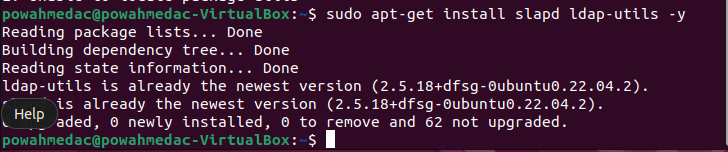
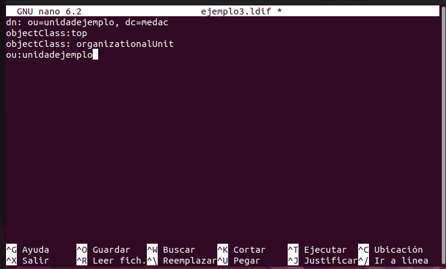
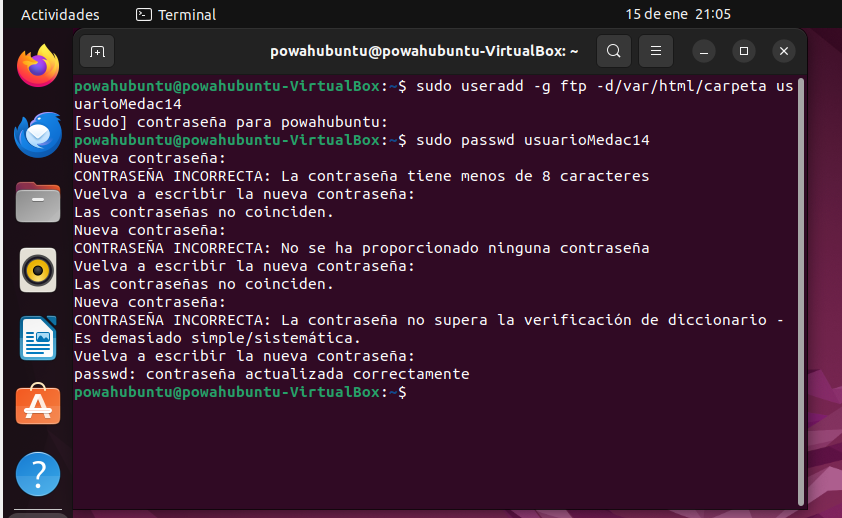

## LDAP
Primero escribiremos el siguiente comando: _sudo apt-get install ldap ldap-utils -y_

con este comando lo que haremos sera instalar el LDAP

Luego el siguiente comando que escribiremos sera el _Systemctl status ldap_ esto lo usaremos para poder comprobar el estado del comando

Despues de realizar esos dos comandos usaremos el _sudo slapcat_ para ver el directorio y los datos que hay este paso no es obligatorio pero si recomendado
despues iremos a lo importante que es hacer _sudo nano ejemplo3.ldif_ dentro pondremos los siguientes comandos:

 

este comando creara el archivo y ademas introduciremos los datos del objeto es decir pondremos:
dc: Dominio al que corresponde. 
uid: Identificador único del objeto dentro del directorio. 
objectClass: Formato del objeto. 
o: Organización del dominio.
ou: Unidad organizativa.
userPassword: Contraseña asignada.
lo pondremos todo guiandonos de las definiciones que puse tal y como puse en la foto

Tras esto usaremos el comando _sudo ldapadd -x -D cn=admin,dc=medac -w -f ejemplo3.ldif_ te pedira la contraseña en este caso salia un error desconocido el cual pone _invalid credentials_ a si que en vez de ese comando pondremos el _sudo dpkg-reconfigure slapd_

  

 

 

 

 Con eso basicamente podremos ponerle y crear nombre al dominio y a la organizacion.

## DNS 

a continuacion seguiremos con el DNS el cual para utilizarlo primero usaremos el comando "sudo apt install bind9" con ese comando se nos descargara el Bind 9. despues usaremos los comandos _cd /etc/blind_ y _ls -l_
con esos comandos primero accedermos al directorio y despues podremos ver:
named.conf.local: Sirve para realizar la configuración local utilizando dominios/servidores locales. 
named.conf.options: Sirve para realizar la configuración e incluir servidores DNS públicos para las consultas que se realizan en Internet. 
named.default-zones: Sirve para configurar las zonas primarias e inversas.

## DHCP

para poder utilizar el protocolo dhcp tendremos que instalar el paquete isc-dhcp-server ademas cuando se haya instalado usaremos el directorio etc/dhcp para configurarlo los comandos son los siguientes:
optiondomain-name dominio: Para configurar el nombre del dominio. 
default-lease-time tiempo: Para configurar el tiempo de asignación de la dirección IP. 
max-lease-time tiempo: Para indicar el tiempo máximo de asignación de la dirección IP. 
subnet subrednetmaskmáscara: Se utiliza para indicar la subred y la máscara de subred. 
rangeIP inicial IP final: Para configurar el rango de direcciones IP, indicando la inicial y la final. 
optionmascara_subred: Para indicar la dirección de la máscara de subred. • optiondireccion_broadcast: Para señalar la dirección de broadcast. 
option_routers: Para indicar la dirección de la puerta de enlace. 

Tambien tendremos que hacer del punto 9 el caso practico 2 la instalacion de servicio DHCP en el cual deberemos de cambiar ademas el tiempo de ip en 5 segundos de minimo y en el maximo "X" segundos siendo X el numero de el grupo es decir en mi caso 14 segundos. A continuacion dejare capturas de los pasos realizados:

.png)

## FTP

Para instalar el servidor VSFTPD utilizaremos el siguiente comando

Despues de instalarlo lo configuraremos para que se ejecute cuando se inicie el sistema.

Despues crearemos un nuevo usuario y ademas le asignaremos una contraseña tambien usaremos un comando para acceder a la IP FTP en nuestro caso sera la nuestra local y si quieres utilizarlo podemos usar el filezilla adjunto las imagenes

